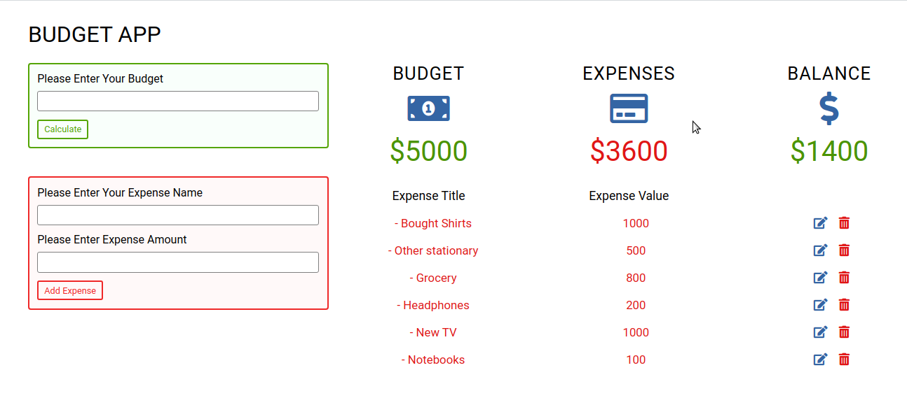

# Budget App

Javascript Budget App to keep track of your expenses. [Live Demo](https://budgetappjs.netlify.com/)

### Introduction

It is a practice project to apply the javascript skills I learned. Aim was to create a frontend application with full CRUD functionality. I helped me to collect and apply the knowledge I gained from tutorials and books.

Includes:

* Querying The Dom
* CRUD functionality
* Dom Element creation
* Working with Event Handlers

### Technologies

- HTML
- CSS
- Javascript (ES6)

